As a web analyst, the most important thing recently for my is the sunsetting of Universal Analytics - from July 1, 2023, it will stop processing data (though the data itself will be kept for at least other 6 months , which means all preparations should be done as soon as possible.

Therefore, I was looking for methods to efficiently backup the Universal Analytics' reports for my organization. However, as you may imagine (or you might be even facing the similar problem!), we have a rich history to be saved, and some of them are actually just too big to imagine.

For example, if I would like to backup a report that contains Date, Page Urls, Default Channel Groups, and (maybe) Source/Medium as dimensions, and Users, Sessions, etc. as metrics, then there might be around **2 million rows** of data!

The reason why it could be so big is actually very simple: by adding more dimensions, you are actually adding **all possible combinations** of them, which will lead to multiplying. And if you have dimensions that have many possible values (such as Date, but it is indeed vital for time series analysis), then this will be the problem that you have to handle.

So, basically, we have **3 major ways to export Universal Analytics' reports**:

(Sorry, BigQuery won't be included in this article, as it is not part of my team's tech stack yet. I do believe it could be efficient and you should really try it out if you can.)

## 1. Export it directly from Universal Analytics

The most intuitive way to backup your UA reports is, of course, simply exporting them within UA itself.

Head to the report (it could be preset or custom) you would like to export, and look at the upper-right corner, then you will find the export option: PDF, Google Sheets, Excel, and CSV. Since we would like it to be easy for following data cleaning and transformation procedures, I would recommend you to export it as CSV files.

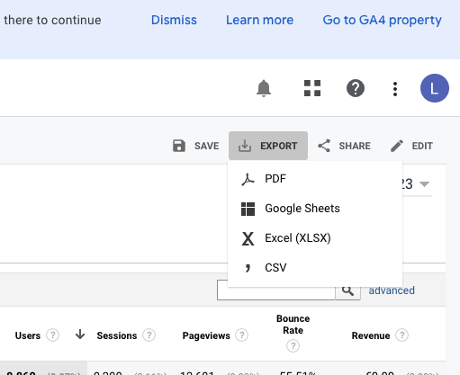

However, this simple way does have shortcomings:

1. It has an obvious limitation of numbers of dimensions (5 at total).

In this following example, I added 5 dimensions, which barely could help me differentiate my traffics, but I couldn't go further with other dimensions with this limitation. (Good news is that the metrics number is actually generous!)

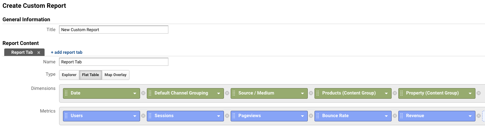

2. It can only export one page of data per time (maximum 5000 rows).

For example, the current report I create actually contains more than 200k rows, which makes it tedious and error prone to manually export them one-by-one.

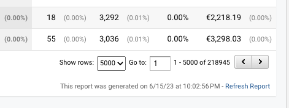

3. You will have useless headers within your CSV files, which increase the difficulty of data cleaning.

Thus, unless your dataset is really small or you would like it to be stored in PDF format, I would not recommend you to export your reports in this way.

## 2. Google Sheet and Official Add-On of Google Analytics

The second method can literally help us bypass many limitations: using the official add-on of Google Analytics in Google Sheet. You can find it through the menu bar - Extension - Add-ons - Get add-ons - (then search for the following one):

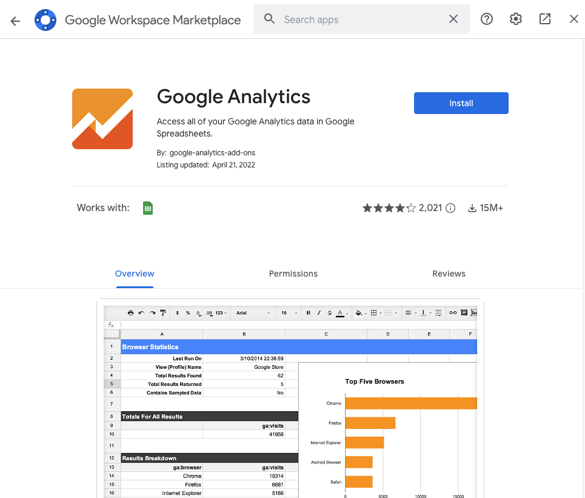

After adding this, you can use the "Create New Report" option to create your custom report:

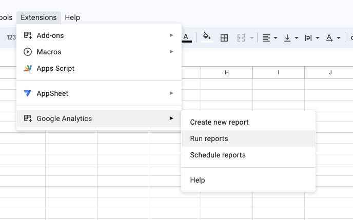

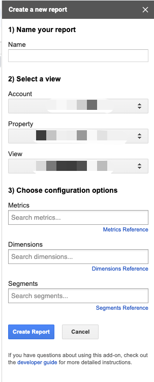

After clicking "Create Report", a new configuration tab will be generated, and you could modify them for the report name, date range, etc. (You cannot add custom dimensions or content groups in the UI, but you will be able to do so here. I won't elaborate on it in this article.) More importantly, you can edit the limitation of rows, and create multiple reports in one go.

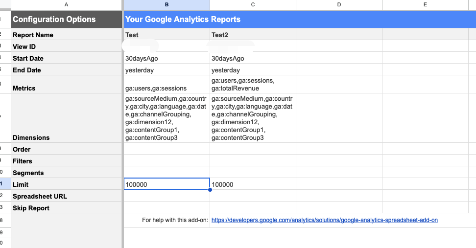

When you are ready, click "Run Reports" - after a short waiting, you get it! I used this method to successfully export more than 2 million rows in one go.

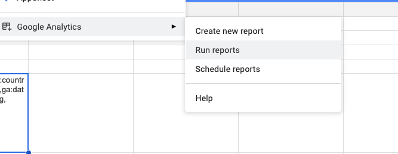

In this way, you can actually bypass most limitations of the default export, such as the 5 dimensions or 5000 rows at one run. However, this does not mean limitations are gone - they are just way higher.

If you try to add more than 9 dimensions, or if the dataset is too big to fetch, you will still get error messages. Additionally, the maximum number of metrics is even fewer than the default option.

Last but not least, Google Sheet might not be a great tool to handle sensitive business data, especially to store it. Thus, privacy issue could also be a concern of this method.

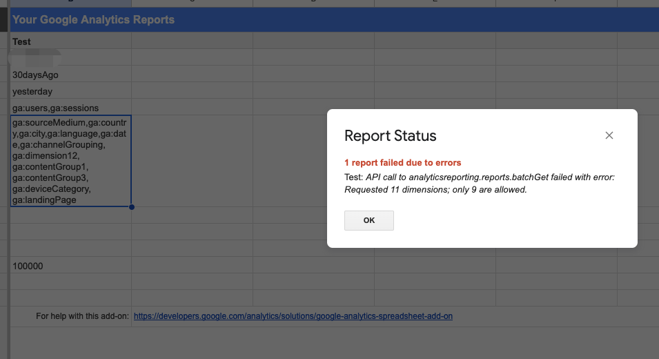

Luckily, we have the last method, which is almost perfect.

## 3. Use Looker Studio to export your reports

I accidentally found this last method, which is almost the simplest and most efficient way: use the export option of Looker Studio (formerly known as Data Studio). There are still some limitations on dimensions and metrics, but it is still much better and more than enough.

To do this, you just need to create a new report (or any existing report you'd like), connect your UA property, and create a table that contains the dimensions and metrics you'd like (you can also add segments or filters on it).

Then click the little 3 dots for "More" at the upper-right corner of your table, and then click "Export":

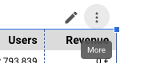

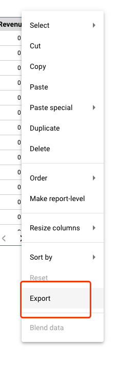

Basically, then it is done! 

The CSV file you export in this way is actually very clean (without ugly headers). I almost never encounter errors with this method. Sometimes, your dataset might still be too big for Looker Studio, and it will show this warning:

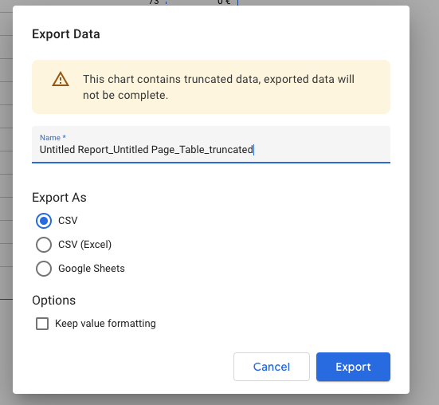

When this happens, you can shorten the date range of your table and then export chronologically - generally you only need to export two or three times, which isn't much, is it?

In conclusion, I would definitely recommend you to take the last method, as it is most efficient, stable, and safe. I don't know if Google will publish any update on it, or provide us with some way to really **copy** the whole property's data, but at least you could efficiently backup your crucial reports now.