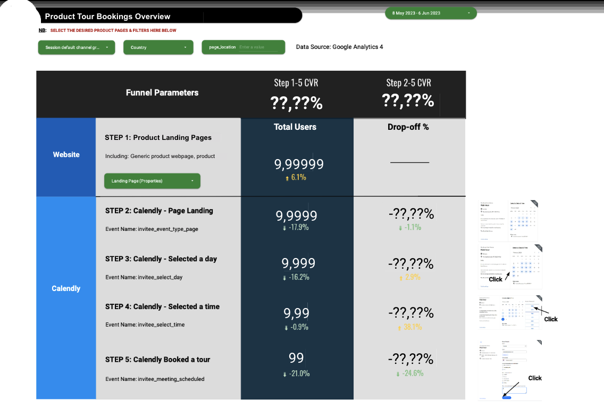

By introducing this project, I would like to discuss an interesting and simple question I encountered while working on funnel optimization:

**Should the funnel dashboards really look like a funnel?**

This project is in fact a relatively tiny dashboard I built and redesigned for the funnel optimizations of a product from our organization. Though it may look tiny, it has been used for the stakeholder's regular reporting as a sole source of truth for funnel traffics - which means it will be used as a data visualization in slides, many, many, many times.

And it looks like this:

(I used a pdf editor to alter numbers in it, so the numbers may look a bit weird.)

Wait... it does not even look like a funnel, right?

There is actually a more "funnel" version that looks like this, which was built by an other colleague:

When I took over the dashboard, I was told by my manager, Cimone, to completely rebuild it, since it was broken due to recent changes in our Google Tag Manager. However, we both had a feeling that not only the filters or blended data should be fixed, but also the visualization itself - it looked good, but our stakeholder just did not really use it.

After a short discussion, the reason quickly became obvious: it is simply too long. So long that it cannot fit in any slide - and if you make it smaller, then numbers will be hard to read. It might be good to look at (and that's why stakeholder said it was "good"), but was not very useful.

So, the solution is also clear: try to make it shorter. Cimone suggested that I could make it tabular, but I was initially hesitant - all in all, it is technically a funnel, right?

So, I created a mixture of tabular and funnel look, and it looked already better than the original, because - see, it now can fit in a slide page without too many changes.

However, is the blue arrow really necessary? What if I want to extend the funnel (spoiler: we did)?... After discussing with Cimone, I made the final change, and then that was the one you saw at the beginning.

You may have noticed: even with an additional step in the funnel, it is in fact shorter, and contains more information (we also have other tables and graphs below in the dashboard for detailed breakdowns).

Surely, there are still a bunch of questions could be asked and experiments that I tried. For example, I tried to use a community visualization specialized for funnel graph, but then it would introduce maintenance risk of it (it might stop updating, etc.). I also tried a smart idea of using two mirrored bar charts to play as the funnel, but it also has similar pitfalls...

This little project actually made me think of the relationship between a data analyst and the stakeholder. We are **not** simple dashboard builders, instead, dashboard is just a means to (automatically) convey insights.

Therefore, the form of delivery matters: our work needs to be able to be used by stakeholders, no matter in their minds, slides, or simply an email. Otherwise, they cannot be translated into actions at the first step.

To avoid such an ironic outcome, we sometimes need to jump out of the box - for example, yes, a funnel does not have to look like a funnel. A funnel, after all, is just an analogy.

